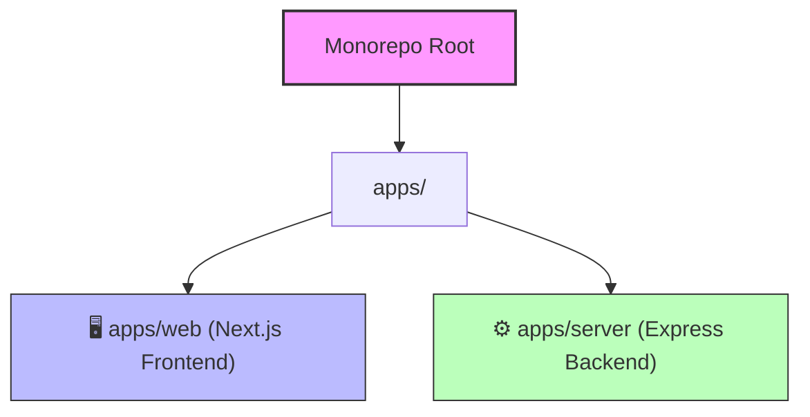

# ✈️ CholoBuddy

[](https://nextjs.org/)
[](https://expressjs.com/)
[](https://www.mongodb.com/)
[](https://www.better-auth.com/)
[](https://pnpm.io/)
[](https://turbo.build/)

> **CholoBuddy** is a premium travel portal 🗺️ and editorial platform 📖 designed to explore and book curated tours across Bangladesh 🇧🇩.

✨ **Tech Highlights:**
* 🖥️ **Frontend:** Next.js 15 + Styled-Components + Framer Motion (Bilingual Toggle 🇬🇧/🇧🇩)
* ⚙️ **Backend:** Express.js + TS (Serverless-ready for Vercel ⚡)
* 💾 **Database & Auth:** MongoDB 🍃 + Better Auth 🔒

---

## 🏗️ Repository Architecture

This project is organized as a high-performance monorepo using **pnpm workspaces** and coordinated by **Turborepo**:



### 1. Frontend Web Application (`apps/web`)
* **Framework**: Next.js 15+ (App Router).
* **Styling**: Vanilla `styled-components` (`styles.ts`) encapsulated within individual component directories, completely bypassing Tailwind CSS for modular design control.
* **Localization**: Full internationalization toggle system (English & Bengali) powered by `react-i18next`.
* **Animations**: Fluid, staggered entries and micro-interactions powered by `framer-motion`.
* **Client-Side State**: Dedicated state hooks for reservations, user profiles, search, wishlists, and support chat.

### 2. Backend Server Application (`apps/server`)
* **Framework**: Express.js with TypeScript (`NodeNext` module resolution).
* **Database**: Native MongoDB drivers communicating with MongoDB Cloud Clusters.
* **Authentication**: Better Auth integration for secure user sessions.
* **Validation**: Request validation schemas powered by Zod.
* **Deployment Ready**: Configured to run as a native server locally OR serverless on Vercel.

---

## 🚀 Getting Started

### Prerequisites
Ensure you have [Node.js](https://nodejs.org/) (v18+) and [pnpm](https://pnpm.io/) installed.

### 1. Installation
Run the following command from the monorepo root to install all dependencies:
```bash
pnpm install
```

### 2. Environment Configuration
Create `.env` files in both application directories.

#### **Frontend Configuration** (`apps/web/.env`)
```env
NEXT_PUBLIC_FRONTEND_URL="http://localhost:3000"
NEXT_PUBLIC_BACKEND_URL="http://localhost:3001"
```

#### **Backend Configuration** (`apps/server/.env`)
```env
PORT=3001
MONGODB_URI="your-mongodb-connection-string"
BETTER_AUTH_SECRET="your-better-auth-secret-key"
BETTER_AUTH_URL="http://localhost:3000"
NEXT_PUBLIC_FRONTEND_URL="http://localhost:3000"
IMGBB_API_KEY="your-imgbb-api-key"
```

### 3. Development
Start the frontend (port `3000`) and the backend (port `3001`) simultaneously:
```bash
pnpm run dev
```

### 4. Build
Compile and bundle both applications for production:
```bash
pnpm run build
```

---

## ⚡ Workspace Command Reference

All monorepo actions are ran from the root using Turborepo or `pnpm` workspace filters:

| Command | Description |
| :--- | :--- |
| `pnpm run dev` | Start both development servers concurrently with hot-reloading |
| `pnpm run build` | Compile and build both applications for production |
| `pnpm run build:web` | Build only the Next.js frontend |
| `pnpm run build:server` | Build only the Express backend |
| `pnpm run start:web` | Run the Next.js production server |
| `pnpm run start:server` | Run the Express backend production server |

---

## ☁️ Vercel Deployment

Both applications are configured for deployment to **Vercel**. 

> [!NOTE]
> Since Vercel operates on serverless functions, the backend Express application has been adapted to skip port listening and export a serverless handler when deployed (`process.env.VERCEL` detected).

### **Vercel Settings Matrix**

| Project | Settings | Environment Variables |
| :--- | :--- | :--- |
| **Frontend (`apps/web`)** | **Root Directory**: `apps/web` | `NEXT_PUBLIC_FRONTEND_URL="https://your-frontend.vercel.app"`<br>`NEXT_PUBLIC_BACKEND_URL="https://your-backend.vercel.app"` |
| **Backend (`apps/server`)** | **Root Directory**: `apps/server` | `MONGODB_URI="..."`<br>`BETTER_AUTH_SECRET="..."`<br>`BETTER_AUTH_URL="https://your-frontend.vercel.app"`<br>`NEXT_PUBLIC_FRONTEND_URL="https://your-frontend.vercel.app"`<br>`IMGBB_API_KEY="..."`<br>`NODE_ENV="production"` |

---

## 🎨 Premium Styling & Component Design

To keep the platform's visual identity feeling highly premium:
1. **Design Tokens**: Reuses harmonious, tailored hex values (primary: `#000000`, secondary: `#526069`, tertiary: `#705d00`, surface: `#f8f9fa`) to build high-end editorial experiences.
2. **Modular Style Isolation**: Each component contains an `index.tsx` for layout and a `styles.ts` for styled-components. No global utility classes are used.
3. **Smooth Micro-Animations**: Smooth scale transforms, opacity transitions, and glassmorphic backdrops create modern interactive depth.
