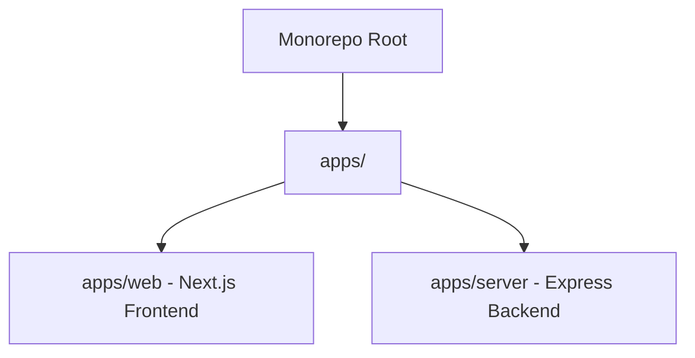

# CholoBuddy

CholoBuddy  is a premium travel portal and editorial platform designed to manage and discover curated experiences across Bangladesh. Built as a monorepo, it features a modern, responsive frontend and a secure Express.js server backend.

---

## 🏗️ Repository Architecture

This project is organized as a monorepo using **pnpm workspaces**:



### 1. Web Application (`apps/web`)
* **Framework**: Next.js 15+ (App Router).
* **Styling**: Bypasses Tailwind CSS in favor of **Vanilla styled-components** (`*.styles.ts`) side-by-side with markup files to keep page logic and design systems isolated.
* **Localization**: Full internationalization toggle system (English & Bengali) powered by `react-i18next` and loaded via static dictionaries in `locales/`.
* **Animations**: Fluid, staggered entries and transitions managed through `framer-motion`.
* **State Management & Custom Hooks**: Isolated client-side state hooks for reservations, authentication, search configurations, wishlists, and real-time support chat.

### 2. Server Application (`apps/server`)
* **Framework**: Express.js with TypeScript (`NodeNext` module resolution).
* **Database**: Native MongoDB drivers communicating with Cloud MongoDB clusters.
* **Auth**: Better Auth integration mapping custom session management.
* **Validation**: Request body schema validation using Zod.
* **Storage**: Image uploads handled via Multer to secure server directories.

---

## 🚀 Getting Started

### Prerequisites
Make sure you have [Node.js](https://nodejs.org/) (v18+) and [pnpm](https://pnpm.io/) installed.

### Installation
From the monorepo root, install all package dependencies:
```bash
pnpm install
```

### Environment Variables
Configure your variables in the root directory. Create `.env` files in `apps/web/.env` and `apps/server/.env` based on your project configuration settings.

### Development Mode
Start both the Next.js frontend (port `3000`) and the Express server backend (port `3001`) in hot-reload watch mode simultaneously:
```bash
pnpm run dev
```

### Production Build
Build and bundle both packages for production distribution:
```bash
pnpm run build
```

---

## 🛠️ Monorepo Scripts Reference

All workspace actions are driven from the root `package.json` package scripts using `pnpm` workspace filters:

| Script | Command | Description |
|---|---|---|
| `pnpm run dev` | `pnpm --filter web dev & pnpm --filter server dev` | Runs both applications simultaneously in development mode. |
| `pnpm run build` | `pnpm --filter web build && pnpm --filter server build` | Builds both apps sequentially. |
| `pnpm run build:web` | `pnpm --filter web build` | Compiles and builds the frontend web app. |
| `pnpm run build:server` | `pnpm --filter server build` | Compiles the backend TypeScript server. |
| `pnpm run start:web` | `pnpm --filter web start` | Starts the production built frontend. |
| `pnpm run start:server` | `pnpm --filter server start` | Starts the production built Express server. |

---

## 🌟 Styling Standards & Component Modularity

To maintain high aesthetics and performance:
1. **No Utility Frameworks**: Bypasses Tailwind compile targets completely. Styles are defined inside separate `[component].styles.ts` or `[page].styles.ts` files.
2. **Design Tokens**: Reuses harmonious, tailored hex values (primary: `#000000`, secondary: `#526069`, tertiary: `#705d00`, surface: `#f8f9fa`) to build high-end editorial experiences.
3. **No Placeholders**: Leverages native rendering and static resources directly from Google Photos and Unsplash asset caches.
